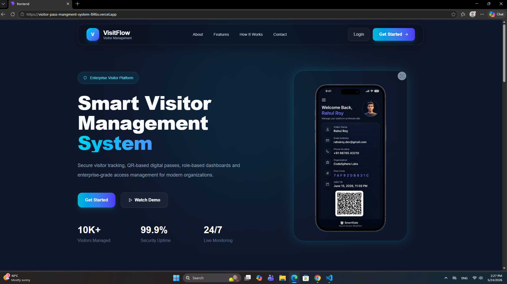
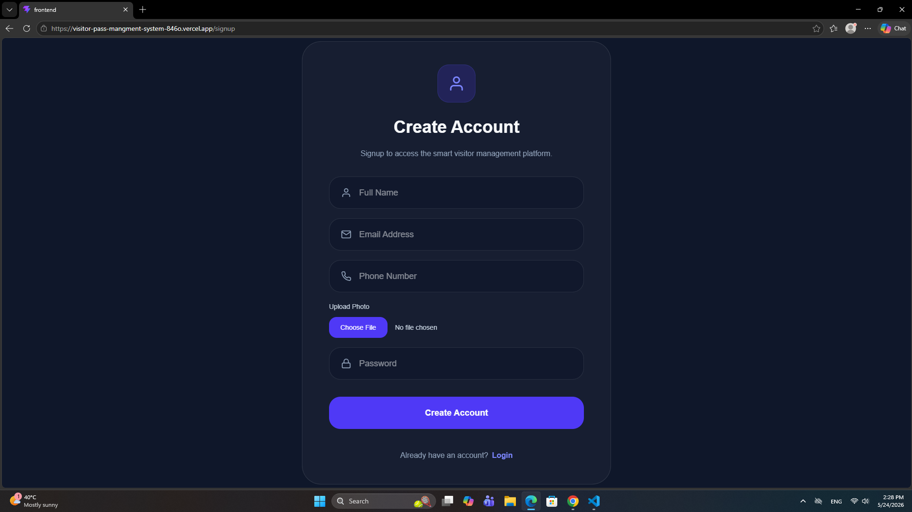
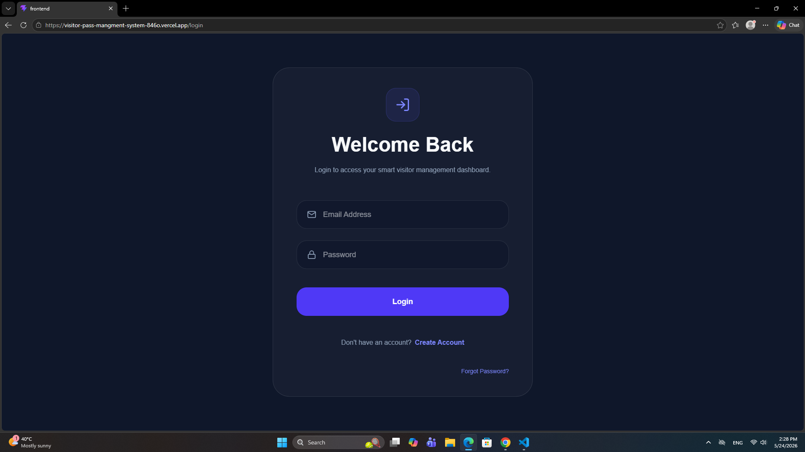
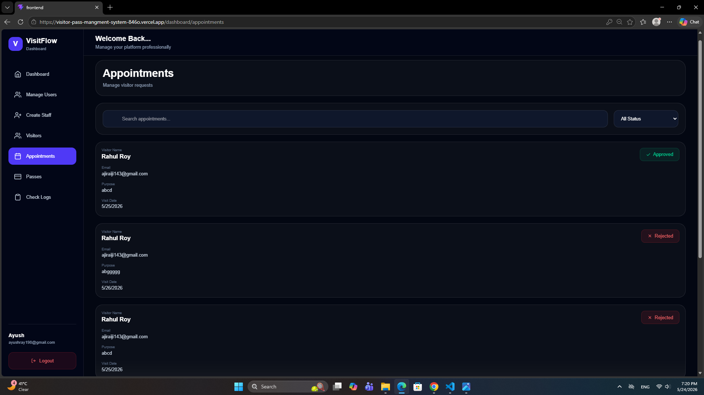
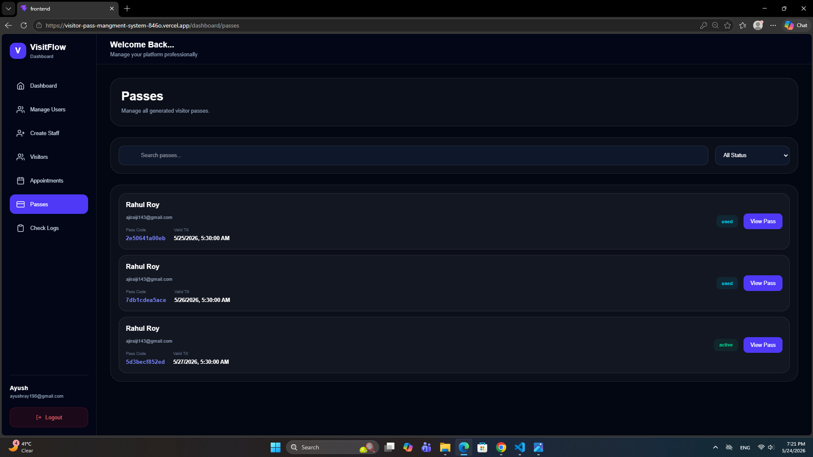
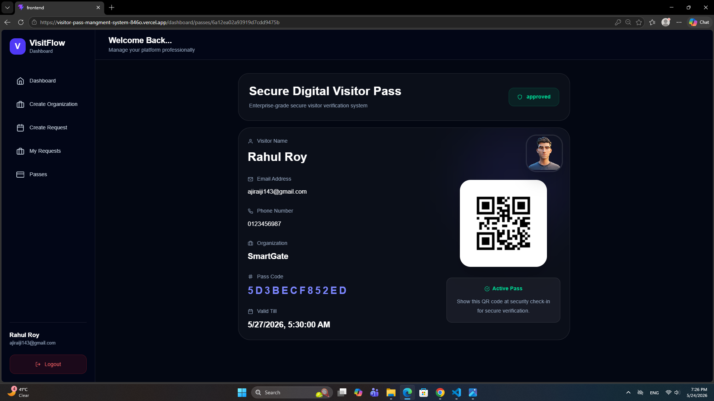
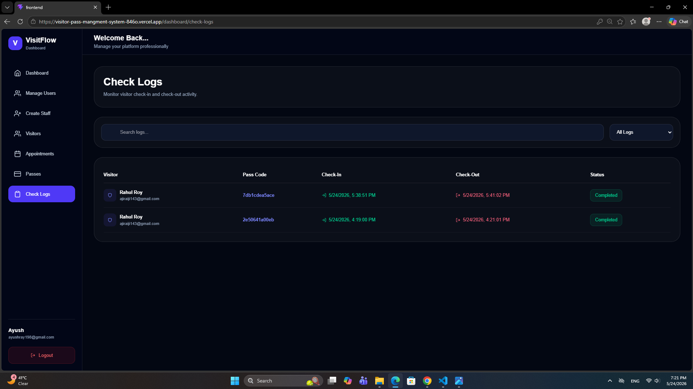

# Visitor Pass Managment System 

# live demo
- Frontend .Vercel. :  https://visitor-pass-mangment-system.vercel.app

- Backend .Render. :   https://visitor-pass-mangment-system.onrender.com

This is a full-stack Visitor pass managment system built using the MERN stack.

I built this project to improve my frontend and backend skills and to understand how real-world MERN applications work together.

While building this project, I learned authentication, role-based access control, QR code generation, PDF generation, dashboard management, and API integration.

this system helps organizations manage visitors, appoinments, passes, and security verification in a more organized way.

# why i built this project 

i built this project to improve my frontend and backend skills.

while working on it , i learned: 

- How authentication works 
- How to protect routes
- How role based access works
- How to connect frontend and backend 
- How to manage APIs
- How to structure a large project 
- How to debug real problems 

This project helped me understand how defrent parts of MERN application work together.

# features

## Authentication 

- Signip and Login
- OTP Verification 
- JWT Authentication 
- Protected Routes 
- Role based Acces 

## Visitor managment 

- Add Visitors 
- Upload visitors Photo 
- Visitor Details page 
- Search and Filter Visitors 

## Appointment mangment 

- Create Appointment requests
- Approve / Reject Requests
- Track Appointment 

## Pass Management 

- Generate Visitor Pass 
- QR Code generation 
- Pdf pass Generation 
- Send pass Through Email 

## Security Features 

- Visitor Check-in
- Visitor Check-out
- QR Verification 
- Check Logs 

## Dashboard 

- Visitors Analytics 
- Appointmnet Statics 
- pending request 
- Charts using Recharts 

## Ui

- Responsive Dasbord 
- Sidebar Navigation 
- Reusable Components 
- Search and Filter 

# ScreenShots 

## Landing page

## Signup & Login

## Dashboard

1[Dashboard](./screenshots/dashboard-page.png)

## Appointments 

# Pass Management 

## Digital Pass

## QR Scanner

1[Scanner](./screenshots/scanner-page.jpg)

## Check Logs

# Teck Stack 

## Frontend

- React.js
- React Router DOM 
- Tailwind CSS
- Axios 
- Reacharts 
- React Icons

## Backend 

- Node.js 
- Express.js
- MongoDB
- Mongoose
- JWT 
- Multer
- NodeMailer
- PDFKit
- QRCode

# Problems I Faced

While building this prroject, i faced many issue and bugs.

Some major problems were:

- Nested routing issues in React Router 
- Role based dashboard rendering problems
- Sidebar responsiveness issues 
- Recharts chart size errors 
- PDF generation issues 
- file upload handling 
- Authentication flow Bugs 
- Protected route issues 

At first , some of these problems were confusing, especialy routing and role based access.

# How I Solved them 

I solved these problems by debugging step by step and checking ducomentation carefully.

some important fixes were 

- Used `Outlet()` correctly for nested routes 
- Created reusable protectedRoutes and roleRoutes components
- Fixed Chart rendering issues by adjusting chart container size 
- Fixed sidebar responsiveness using flex and width handling 
- Used reusable search and filter components
- Used `.gitignore` properly for envirment files
- Fixed role based navigation logic

This project improved my debugging and problrms-solving skills a lot.

# Project structure

## Frontend

- components
- Pages
- Layout
- Routes
- API

## Backend 

- Controllers 
- Models
- Routes 
- Middleware
- Services
- Utils

# Package Installation

## Frontend 

- react
- react-dom
- react-router-dom
- axios 
- tailwindcss
- @tailwindcss/vite
- react-hot-toast
- react-icons
- recharts 

## Backend 

- express
- mongoose
- dotenv
- cors
- bcryptjs
- jsonwebtoken 
- nodemailer 
- multer
- qrcode
- pdfkit
- crypto
- nodemon 

# Important Notes 

- Make sure MongoDb is connected properly 
- Frontend and Backend Should run together 
- Add correct envirment variables before starting the project 

# Final Thoughts

This project helped me understad how real full satck applications are built.

More than adding features, this project improved my confidendce, debugging skills, and understanding of frontend and backend integration. 

I learned a lot while building this project and solving deffrent development issues.